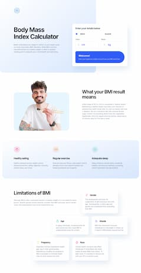
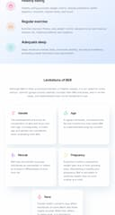

# Frontend Mentor - Body Mass Index Calculator solution

This is a solution to the [Body Mass Index Calculator challenge on Frontend Mentor](https://www.frontendmentor.io/challenges/body-mass-index-calculator-brrBkfSz1T). Frontend Mentor challenges help you improve your coding skills by building realistic projects.

## Table of contents

- [Overview](#overview)
  - [The challenge](#the-challenge)
  - [Screenshot](#screenshot)
  - [Links](#links)
- [My process](#my-process)
  - [Built with](#built-with)
  - [What I learned](#what-i-learned)
  - [Continued development](#continued-development)
- [Author](#author)

## Overview

### The challenge

Users should be able to:

- Select whether they want to use metric or imperial units
- Enter their height and weight
- See their BMI result, with their weight classification and healthy weight range
- View the optimal layout for the interface depending on their device's screen size
- See hover and focus states for all interactive elements on the page

### Screenshot

### Links

- Solution URL: [GitHub](https://github.com/orphandeity/bmi-calculator.git)
- Live Site URL: [GitHub Pages](https://orphandeity.github.io/bmi-calculator/)

## My process

### Built with

- Semantic HTML5 markup
- CSS custom properties
- CSS Grid
- Mobile-first workflow
- [Vite](https://vitejs.dev/) - Frontend Tooling
- [Svelte](https://svelte.dev/) - Component framework

### What I learned

This is the second project where I've been using vanilla CSS exclusively and experimenting with custom properties.
I feel like I'm getting a lot more comfortable with CSS and I'm really starting to think about all the possible use-cases for custom properties.

### Continued development

I'm going to continue exploring and getting more comfortable with Svelte and vanilla CSS. I definitely picked up some ideas working on this project that I'd like to implement in the next one - mostly having to do with custom properties and code organization.

## Author

- Website - [Jeff Williams](https://www.jeffwilliams.xyz)
- Frontend Mentor - [@orphandeity](https://www.frontendmentor.io/profile/orphandeity)
- GitHub - [@orphandeity](https://www.github.com/orphandeity)
